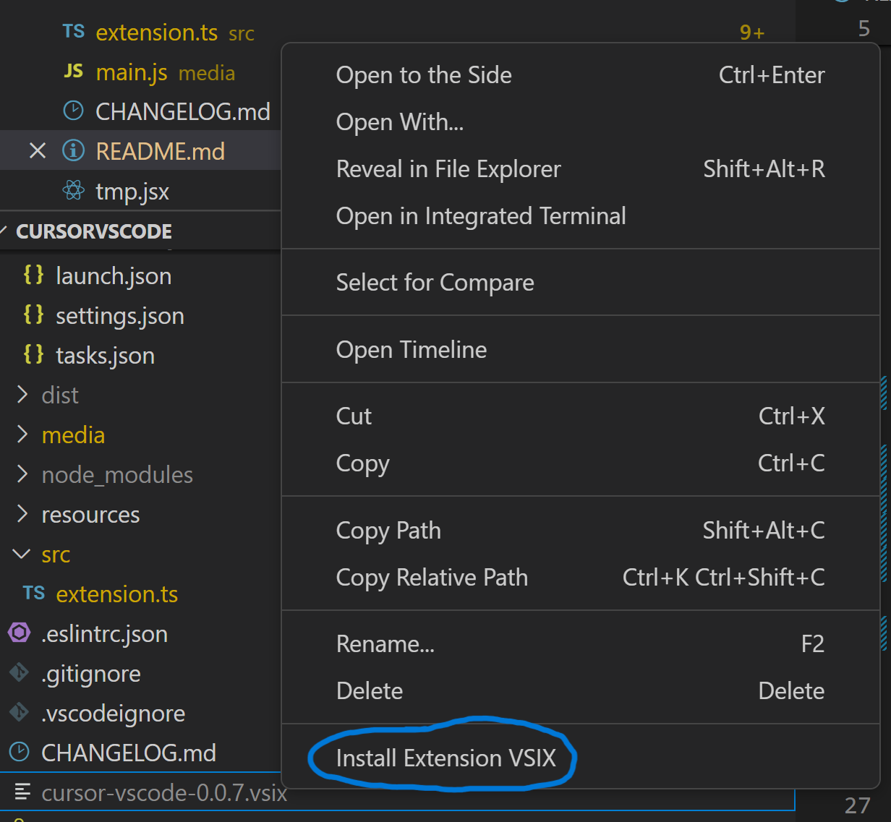

<h2 align="center">
<br><br>CursorVSCode (English translation of CursorCode)</h2>
<p align="center"><strong>Write, edit, and chat about your code with a powerful AI</strong></p>

# Main Features

- 📃Intelligent conversation: chat directly with the robot in the sidebar
- 🔥Code generation: generate code by entering requirements in the code
- 📝Code optimization: optimize code by entering requirements in the code
- :keyboard:Quick insertion: the code generated in the dialog box can be inserted quickly by clicking on the corresponding cursor in the code box
- :key:Shortcut keys: Ctrl+Alt+Y to call up code generation, Ctrl+Alt+U to call up the dialog box

# Getting Started

1. Not currently available in the store

2. Can build locally: 
```
npm ci
vsce package
```
3. Install cursor-vscode-*.*.*.vsix with "Install Extension VSIX"



<center></center>

<center></center>

<center></center>

<center></center>


# Video Tutorial (Chinese)

[https://www.bilibili.com/video/BV1iv4y1G7Js/](https://www.bilibili.com/video/BV1iv4y1G7Js/)

# Links

[CursorCode](https://github.com/Meteo-Pig/CursorCode)

[Cursor](https://www.cursor.so/)

# Related Projects:

[CodeCursor (Cursor for Visual Studio Code)](https://github.com/Helixform/CodeCursor)